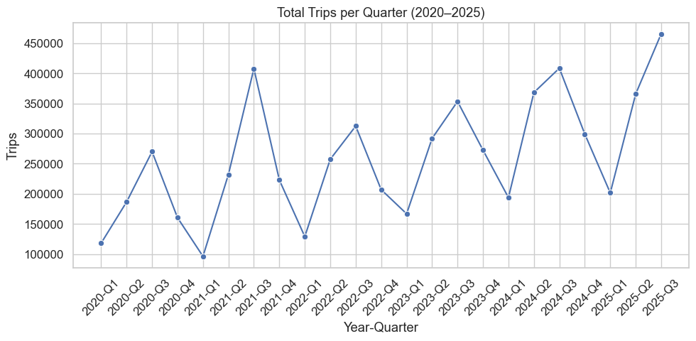
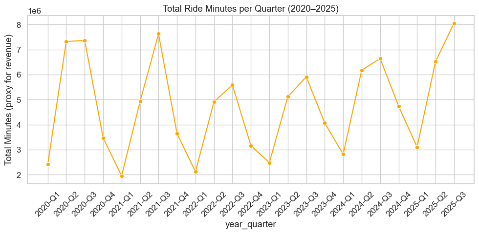
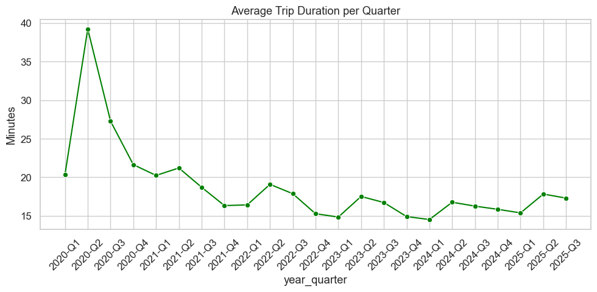
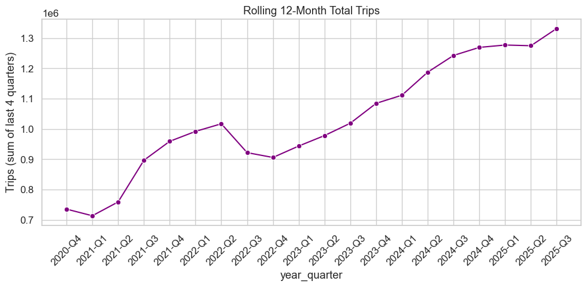

# Perpay Bike Share Data Challenge

  

  <em>Image source: <a href="https://www.rideindego.com/">Indego Philadelphia Bike Share</a></em>

## 👩‍💻 Author
[Mia Tran](https://github.com/MiaTran1112)

---

## 📘 Overview

This analysis explores Indego’s public bike share trip data (2020–2025) to quantify recent program growth, assess sustainability trends, and propose strategic recommendations for future expansion.  

All analyses were performed using Python (`pandas`, `seaborn`, `matplotlib`) and publicly available CSVs from Indego’s open data portal.

---

## 🧮 1. Quantifying Growth

Decision makers can best quantify Indego’s performance using **quarterly time-series metrics**, including:
- **Total Trips** — total demand for rides  
- **Total Ride Minutes** — proxy for total usage and revenue  
- **Average Trip Duration** — indicates trip purpose evolution (leisure vs. commute)  
- **Unique Bikes / Active Stations** — reflect supply-side scale  
- **Quarter-over-Quarter (QoQ) and Year-over-Year (YoY) growth** — track short-term and annual momentum  

---

### 📊 Total Trips per Quarter

  

> Trips show strong seasonality, peaking in spring and summer (Q2–Q3) and dipping in winter. The long-term trend shows healthy, sustained growth post-2021.

---

### 📊 Total Ride Minutes per Quarter

  

> Ride minutes — a proxy for revenue — have more than tripled since 2020, indicating sustained engagement and a growing user base.

---

### 📊 Average Trip Duration

  

> Average trip duration stabilized around 15–20 minutes, suggesting a shift toward daily commuting rather than leisure use.

---

### 📊 Rolling 12-Month Total Trips

  

> Rolling 12-month totals highlight long-term adoption and consistent growth without major declines.

---

Over 2020–2025, Indego exhibited:
- **Average YoY trips growth:** ~14.9%  
- **Average trip duration:** stabilized around 15–20 minutes  
- **Rolling 12-month trips:** nearly doubled since 2021  

---

## 📈 2. Growth Assessment

There is **no indication of overgrowth or stagnation**:
- Trips and ride minutes show **consistent, repeatable seasonality** (peaks in Q2–Q3)  
- **Post-pandemic recovery** has led to steady upward trends without volatility  
- The **rolling 12-month total** demonstrates long-term adoption with no signs of market saturation  

In summary, Indego is **growing at a sustainable and healthy pace**.

---

## 🚀 3. Recommendations for the Period Ahead

**a. Maintain sustainable expansion**  
Continue measured infrastructure growth in response to steady demand increases.  

**b. Strengthen retention and engagement**  
Introduce incentives for winter ridership and long-term memberships to reduce seasonal dips.  

**c. Data-driven optimization**  
Deploy predictive models to balance bike availability and anticipate demand hotspots.  

**d. Monitor key growth KPIs**  
Track quarterly QoQ and YoY trends to ensure scalability remains aligned with demand.

---

## 💡 Key Takeaway
> Indego’s ~15% annual growth rate reflects a **mature, sustainable, and scalable program**.  
> The focus for the next phase should be **strategic optimization**, not aggressive expansion.

---

## 🧰 Project Structure

perpay-bike-share-challenge/
│
├── data/
│   ├── indego-trips-2020-q1.csv
│   ├── indego-trips-2020-q2.csv
│   └── ...
├── images/
│   ├── total_trips_per_quarter.png
│   ├── total_ride_min_per_quarter.png
│   ├── avg_trip_duration.png
│   └── rolling_12month.png
├── notebooks/
│   └── eda.ipynb
├── requirements.txt
└── README.md
